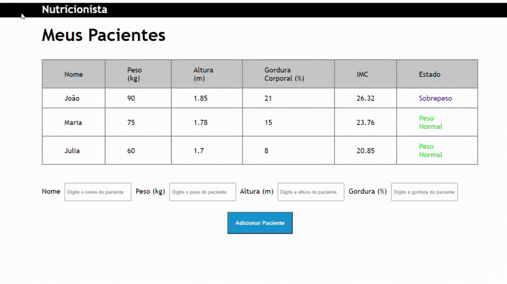

<h1 align="center">Nutricionista</h1>

Site para registro de pacientes e seus respectivos indíces IMC

<h4 align="center"> 
	Concluído 🟢
</h4>

### Features

- [x] Cadastro de clientes
- [x] Cálculo de IMC dos clientes
- [x] Validação dos dados cadastrados
- [x] Classificação do estado do paciente de acordo com o IMC

<h1 align="center">
  
</h1>

### 🛠 Tecnologias

As seguintes ferramentas foram usadas na construção do projeto:

- HTML
- CSS
- JavasCript

